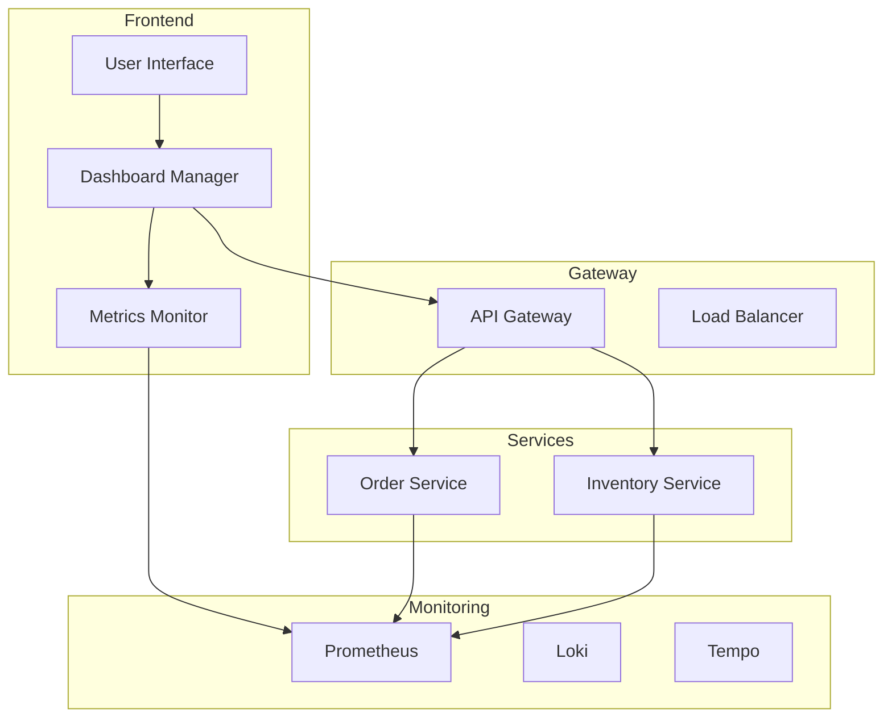
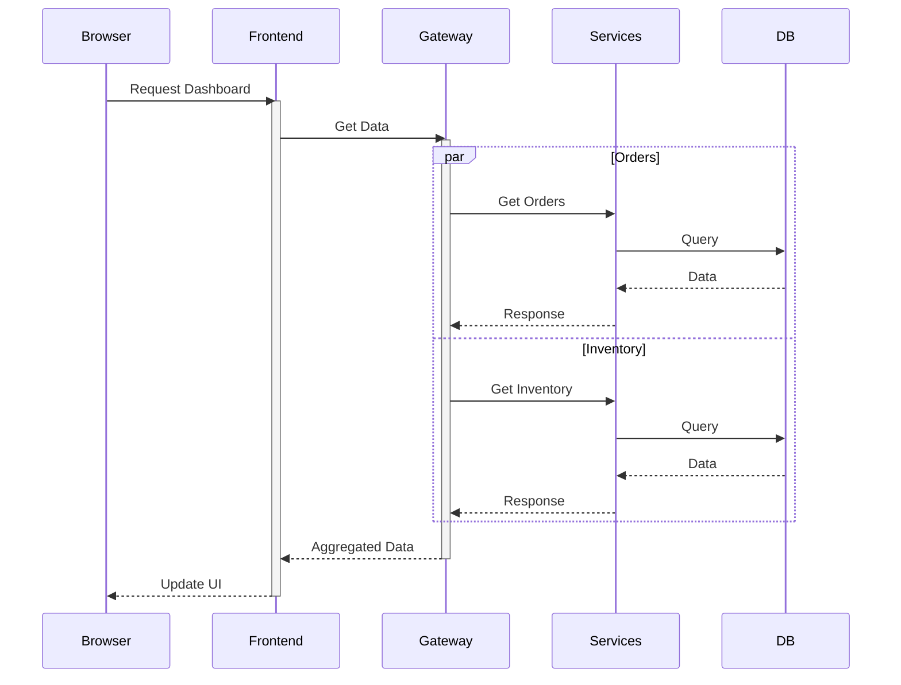

# InsightOps Architecture

## System Overview

## Core Components

### Frontend Service
- ASP.NET Core MVC application
- Real-time dashboard
- Docker management interface
- Service health monitoring

### API Gateway
- Request routing
- Load balancing
- Service aggregation
- Error handling

### Microservices
- Order Service
- Inventory Service
- Independent databases
- Domain-specific logic

### Monitoring Stack
- Prometheus (metrics)
- Loki (logging)
- Tempo (tracing)

## Data Flow

## Technology Stack
- .NET 8
- Docker
- PostgreSQL
- EF Core
- OpenTelemetry
- SignalR (ready)

## Design Patterns
- Microservices Architecture
- Gateway Pattern
- Repository Pattern
- CQRS (for queries)
- Circuit Breaker
- Retry Pattern

[Continue to System Design Details](system-design.md)
