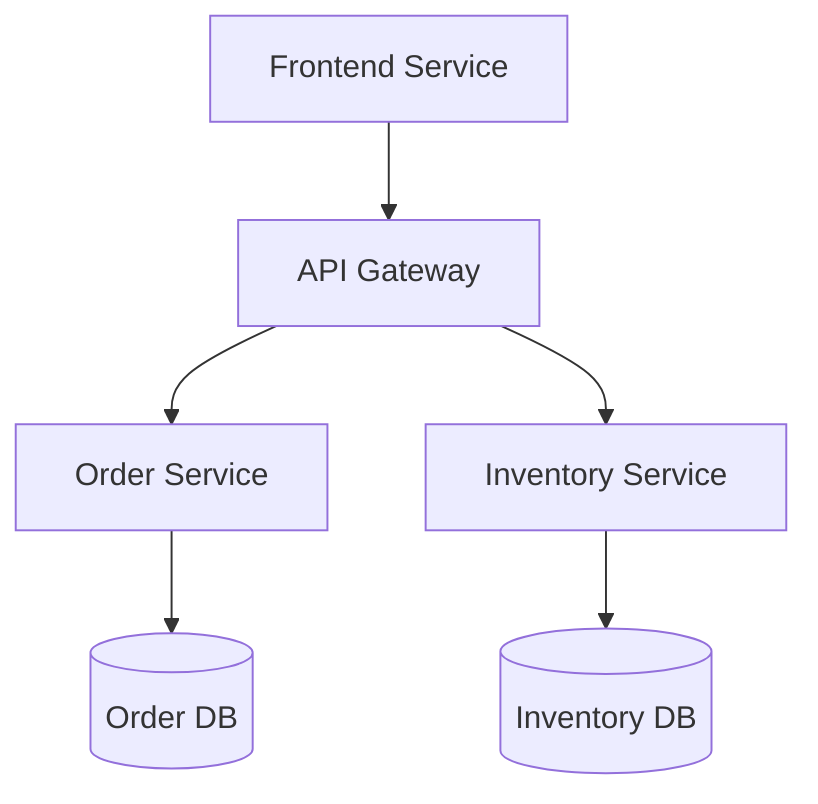

# Architecture Overview

## System Architecture

The InsightOps platform follows a microservices architecture pattern, with the following key components:

- [Frontend Service](services/frontend.md)
- [API Gateway](services/api-gateway.md)
- [Order Service](services/order-service.md)
- [Inventory Service](services/inventory-service.md)

## Service Interaction Diagram

## Core Architectural Principles

1. [Service Independence](principles/service-independence.md)
2. [Data Consistency](principles/data-consistency.md)
3. [Scalability](principles/scalability.md)
4. [Resilience](principles/resilience.md)

## Detailed Documentation

- [System Design](system-design.md)
- [Data Flow](data-flow.md)
- [Security Architecture](security.md)
- [Monitoring Architecture](monitoring.md)
