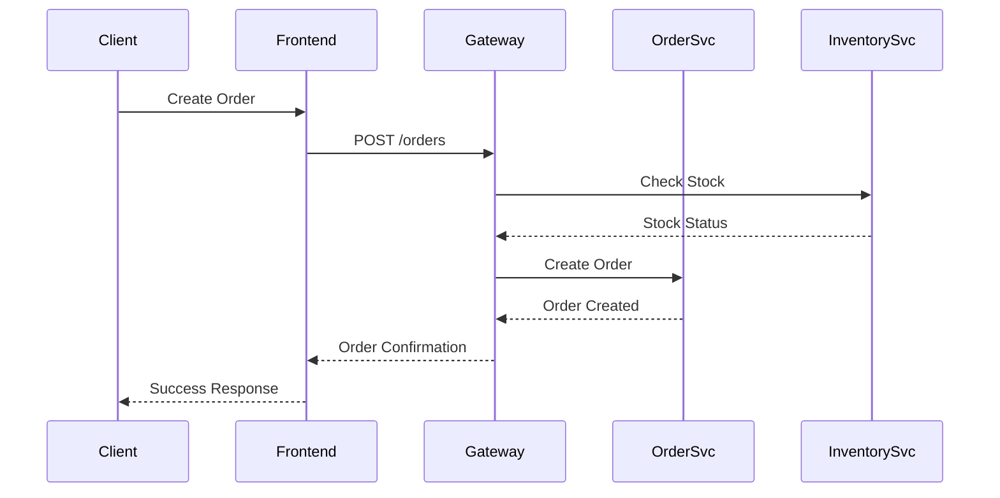

# Data Flow Documentation

## Overview

This document details the data flow patterns within the InsightOps platform.

## Core Data Flows

### Order Processing Flow

### Dashboard Data Flow
[View Dashboard Implementation](../technical-docs/implementation/dashboard.md)

## Data Consistency

### Transaction Management
- [Order Transaction Flow](transactions/order-flow.md)
- [Inventory Transaction Flow](transactions/inventory-flow.md)

### Error Handling
- [Compensation Patterns](error-handling/compensation.md)
- [Retry Strategies](error-handling/retry.md)
