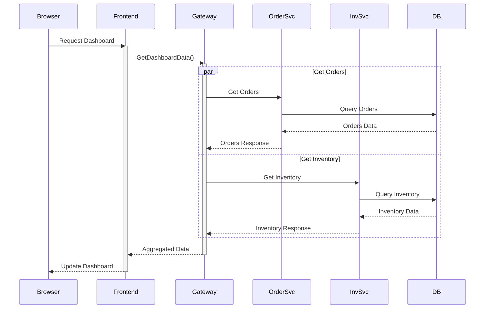

# InsightOps System Deep Analysis

## 1. Architecture Overview

### A. Service Layer Breakdown
```plaintext
Frontend (ASP.NET Core MVC)
├── Dashboard View
│   ├── Real-time Metrics Display
│   ├── Service Health Status
│   └── Resource Monitoring
├── Orders Management
├── Inventory Management
└── Docker Management

API Gateway
├── Request Routing
├── Service Aggregation
└── Health Monitoring

Microservices
├── Order Service
│   └── PostgreSQL Database
└── Inventory Service
    └── PostgreSQL Database

Monitoring Stack
├── Prometheus (Metrics)
├── Loki (Logging)
└── Tempo (Tracing)
```

### B. Communication Flow


## 2. Critical Components Analysis

### A. Frontend Dashboard Implementation
```javascript
// Key Flow Points:
1. Initial Page Load
   - Load static HTML template
   - Initialize JavaScript handlers
   - Set up interval for updates

2. Data Fetching
   - Parallel requests for different data types
   - Error handling
   - Response processing

3. UI Updates
   - DOM manipulation for metrics
   - Chart updates
   - Status indicators
```

### B. API Integration Points
```csharp
// Key Integration Points:
1. GetDashboardData
   - Aggregates multiple service responses
   - Handles timeouts and failures
   - Transforms data for frontend consumption

2. Service Status
   - Health check integration
   - Service metrics collection
   - Resource usage monitoring
```

## 3. Data Flow Analysis

### A. Request Chain
1. Browser initiates dashboard update
2. Frontend controller receives request
3. ApiGateway aggregates service data
4. Individual services process requests
5. Data returns through chain
6. Frontend updates UI

### B. State Management
```plaintext
Dashboard State:
├── Active Orders Count
├── Inventory Status
├── System Health
└── Performance Metrics
```

## 4. UI Component Structure

### A. Dashboard Layout
```plaintext
Operations Control Center
├── Metric Cards
│   ├── Active Orders
│   ├── Inventory Items
│   ├── System Health
│   └── Response Time
├── Service Status Table
└── Resource Usage Charts
```

### B. Data Binding Points
1. Metric Card Updates
2. Service Status Table
3. Resource Usage Indicators
4. Chart Refreshes

## 5. Environment Configurations

### A. Development Environment
```json
{
  "ServiceUrls": {
    "ApiGateway": "http://localhost:7237",
    "OrderService": "http://localhost:5001",
    "InventoryService": "http://localhost:5002"
  }
}
```

### B. Docker Environment
```json
{
  "ServiceUrls": {
    "ApiGateway": "http://apigateway:80"
  }
}
```

## 6. Key Findings

1. **Architecture Strengths:**
   - Clean separation of concerns
   - Modular service design
   - Comprehensive monitoring setup
   - Scalable infrastructure

2. **Data Flow Points:**
   - Multiple async data fetches
   - Parallel request processing
   - Aggregated responses
   - Real-time updates

3. **Integration Patterns:**
   - HTTP/REST communication
   - Health check monitoring
   - Circuit breaker patterns
   - Retry policies

## 7. Areas to Focus

1. **Data Synchronization:**
   - Check timing of parallel requests
   - Verify data consistency across services
   - Monitor update intervals

2. **Error Handling:**
   - Service timeout scenarios
   - Partial data updates
   - Recovery mechanisms

3. **Performance:**
   - Response time monitoring
   - Resource utilization
   - Update frequency optimization

4. **UI Updates:**
   - DOM update efficiency
   - Chart rendering performance
   - Status indicator responsiveness

## 8. Recommended Monitoring Points

1. **Frontend Monitoring:**
```javascript
console.time('dashboardUpdate');
await updateDashboard();
console.timeEnd('dashboardUpdate');

// Track successful updates
let updateSuccess = 0;
let updateFailures = 0;
```

2. **Service Communication:**
```csharp
// Add correlation IDs
using var activity = Activity.Current?.Source.StartActivity();
_logger.LogInformation("Starting dashboard update {CorrelationId}", activity?.Id);
```

3. **Performance Metrics:**
```csharp
var metrics = new
{
    RequestTime = stopwatch.ElapsedMilliseconds,
    ServiceResponses = new[]
    {
        orderResponse.StatusCode,
        inventoryResponse.StatusCode
    },
    DataPoints = orders.Count + inventory.Count
};
```

Based on this analysis, I can provide more specific insights into:
1. The exact data flow and where to add monitoring
2. Performance optimization points
3. Error handling improvements
4. UI update optimization

Would you like me to focus on any particular aspect of this analysis?