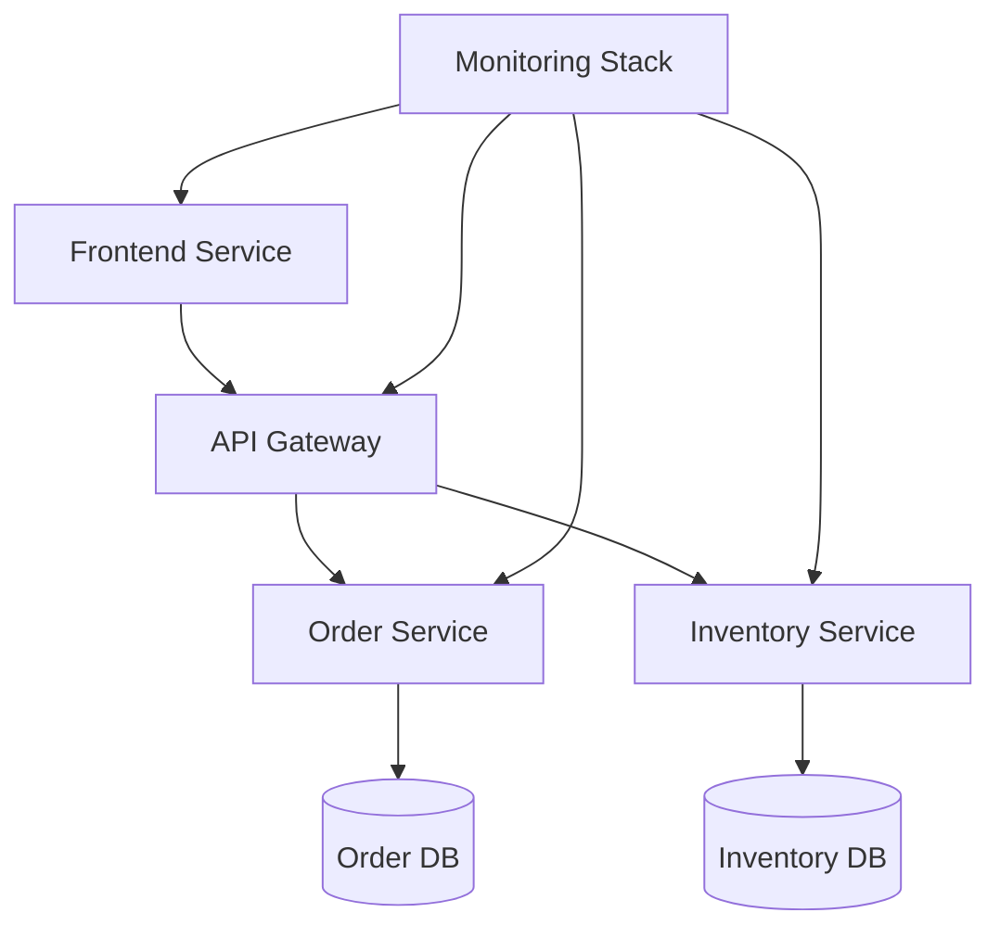

# InsightOps Platform Documentation

## Overview
InsightOps is a comprehensive microservices-based monitoring and operations platform. This documentation provides detailed information about the platform's architecture, implementation, and usage.

## Quick Navigation
- [Getting Started](docs/getting-started/index.md)
- [Architecture](docs/architecture/index.md)
- [Technical Documentation](docs/technical/index.md)
- [Monitoring](docs/monitoring/index.md)
- [Development](docs/development/index.md)

## System Architecture

## Key Features
- Real-time dashboard monitoring
- Service health tracking
- Inventory management
- Order processing
- Docker management
- Performance metrics

## Getting Started
See our [Quick Start Guide](docs/getting-started/quick-start.md) for setup instructions.

## Documentation Structure
- `docs/getting-started/` - Setup and installation guides
- `docs/architecture/` - System design and architecture
- `docs/technical/` - Technical implementation details
- `docs/monitoring/` - Monitoring and maintenance
- `docs/development/` - Development guidelines

## Contributing
Please read our [Contributing Guidelines](CONTRIBUTING.md) before submitting changes.
