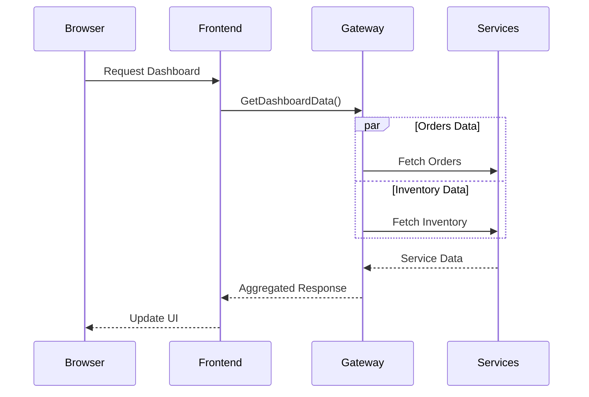

# Documentation Updates

## technical-docs/application-flow/dashboard-operations.md
```markdown
# Dashboard Operations Flow

## Overview
The dashboard implements a real-time monitoring system using a combination of server-side data aggregation and client-side updates.

## Implementation Details

### Data Flow Chain


### Key Components

1. **Browser Update Cycle**
```javascript
// Update interval: 30 seconds
setInterval(updateDashboard, 30000);

async function updateDashboard() {
    const [dashboardData, serviceStatus] = await Promise.all([
        fetch('/Home/GetDashboardData'),
        fetch('/Home/GetServiceStatus')
    ]);
    // Update UI components
}
```

2. **Frontend Controller**
```csharp
public async Task<IActionResult> GetDashboardData()
{
    // Fetch data from services
    // Aggregate responses
    // Return JSON result
}
```

3. **Service Integration Points**
- API Gateway aggregation
- Service health checks
- Metrics collection
```

## technical-docs/monitoring/performance-monitoring.md
```markdown
# Performance Monitoring

## Key Metrics

### 1. Response Times
- API Gateway responses
- Service-specific latency
- Frontend rendering time

### 2. Resource Usage
- CPU utilization
- Memory consumption
- Network bandwidth

### 3. Error Rates
- Failed requests
- Service timeouts
- UI update failures

## Monitoring Points

### Frontend Monitoring
```javascript
// Performance monitoring
console.time('dashboardUpdate');
await updateDashboard();
console.timeEnd('dashboardUpdate');

// Error tracking
try {
    await updateDashboard();
    updateSuccessCount++;
} catch (error) {
    updateErrorCount++;
    console.error('Dashboard update failed:', error);
}
```

### Backend Monitoring
```csharp
// Request tracking
using var activity = Activity.Current?.Source.StartActivity();
_logger.LogInformation("Starting dashboard update {CorrelationId}", activity?.Id);

// Performance metrics
var metrics = new
{
    RequestTime = stopwatch.ElapsedMilliseconds,
    ServiceResponses = new[]
    {
        orderResponse.StatusCode,
        inventoryResponse.StatusCode
    },
    DataPoints = orders.Count + inventory.Count
};
```
```

## technical-docs/troubleshooting/common-issues.md
```markdown
# Common Issues and Resolution Guide

## Dashboard Data Not Updating

### Symptoms
- Empty data fields
- Stale information
- Missing service status

### Diagnostic Steps

1. **Check Network Requests**
   - Open browser DevTools
   - Monitor Network tab
   - Verify request/response cycle

2. **Verify Service Health**
   - Check service status endpoints
   - Verify API Gateway connectivity
   - Monitor service logs

3. **Data Flow Verification**
   ```javascript
   // Add to dashboard.js
   const diagnostics = {
       lastUpdate: null,
       updateAttempts: 0,
       failures: 0,
       
       logUpdate(success) {
           this.lastUpdate = new Date();
           if (success) {
               console.log('Update successful', {
                   timestamp: this.lastUpdate,
                   attempts: this.updateAttempts
               });
           } else {
               this.failures++;
               console.error('Update failed', {
                   failures: this.failures,
                   lastSuccess: this.lastUpdate
               });
           }
       }
   };
   ```

## Resolution Steps

1. **Service Connectivity**
   - Verify service URLs in configuration
   - Check network connectivity
   - Validate Docker network setup

2. **Data Consistency**
   - Verify database connections
   - Check service responses
   - Validate data transformations

3. **Performance Issues**
   - Monitor response times
   - Check resource usage
   - Optimize update frequency
```

## technical-docs/development/optimization-guide.md
```markdown
# Dashboard Optimization Guide

## Frontend Optimizations

### 1. Update Cycle
```javascript
class DashboardManager {
    constructor() {
        this.updateInterval = 30000;
        this.lastUpdate = null;
        this.metrics = {
            updateTime: [],
            errorCount: 0
        };
    }

    async initialize() {
        await this.loadInitialData();
        this.startUpdateCycle();
    }

    private startUpdateCycle() {
        setInterval(() => {
            const start = performance.now();
            this.updateDashboard()
                .then(() => {
                    const duration = performance.now() - start;
                    this.metrics.updateTime.push(duration);
                })
                .catch(error => {
                    this.metrics.errorCount++;
                    console.error('Update failed:', error);
                });
        }, this.updateInterval);
    }
}
```

### 2. Performance Monitoring
```javascript
const performanceMetrics = {
    measureUpdate() {
        const start = performance.now();
        return {
            end() {
                const duration = performance.now() - start;
                console.log(`Dashboard update took ${duration}ms`);
                return duration;
            }
        };
    }
};
```

### 3. Resource Usage
- Implement efficient DOM updates
- Optimize chart rendering
- Cache response data
```

Would you like me to:
1. Add more technical details to any section?
2. Create additional documentation sections?
3. Expand the troubleshooting guide?
4. Add implementation examples?

These documentation updates provide more detailed insights into the system's operation and maintenance. Let me know if you'd like to focus on any particular aspect.