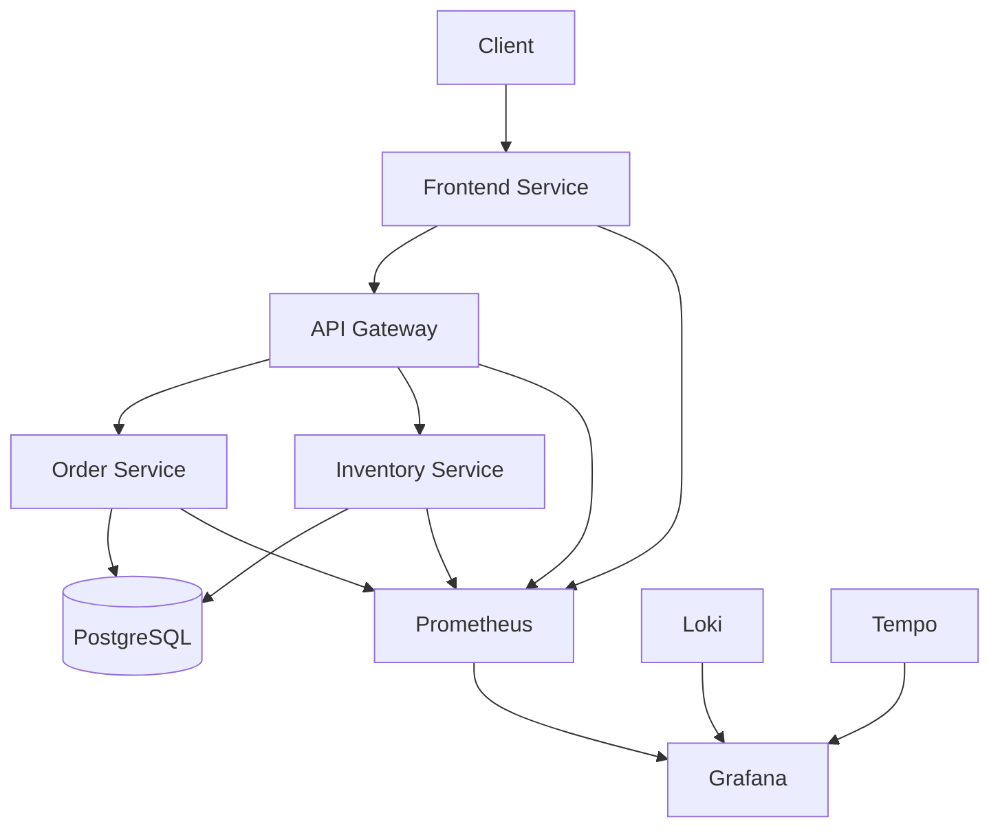

# InsightOps - Enterprise Observability Demo

**InsightOps** is a comprehensive observability demo showcasing microservices monitoring using .NET 8, OpenTelemetry, Prometheus, Grafana, Loki, and Tempo. This project serves as both a learning tool and a production-ready template for enterprise observability.

## Quick Start
```powershell
# Clone and run (Automated setup)
git clone https://github.com/yourusername/InsightOps.git
cd InsightOps
./setup.ps1
```

## Table of Contents
- [Quick Start](#quick-start)
- [Project Overview](#project-overview)
- [Architecture](#architecture)
- [Prerequisites](#prerequisites)
- [Detailed Installation](#detailed-installation)
- [Configuration](#configuration)
- [Running the Project](#running-the-project)
- [Monitoring Setup](#monitoring-setup)
- [Management Scripts](#management-scripts)
- [Troubleshooting](#troubleshooting)
- [Advanced Usage](#advanced-usage)
- [Contributing](#contributing)

## Project Overview

InsightOps demonstrates:
- Real-time metrics collection and visualization
- Distributed tracing across microservices
- Centralized logging with structured data
- Health monitoring and alerting
- Auto-provisioned Grafana dashboards
- Production-ready containerization

### Key Components
- Frontend Service (ASP.NET Core MVC)
- API Gateway (Reverse Proxy)
- Order Service (Microservice)
- Inventory Service (Microservice)
- PostgreSQL Database
- Prometheus (Metrics)
- Grafana (Visualization)
- Loki (Logging)
- Tempo (Tracing)

## Architecture



### Quick Start
```powershell
# Clone and initialize
git clone https://github.com/yourusername/InsightOps.git
cd InsightOps
.\scripts\init-insightOps.ps1
# For development setup with detailed output
.\scripts\init-insightOps.ps1 -Development
# Force configuration recreation
.\scripts\init-insightOps.ps1 -ForceRecreate
```

### Prerequisites Check
```powershell
# Check all prerequisites
.\scripts\utils\check-prereqs.ps1
# Detailed check with versions
.\scripts\utils\check-prereqs.ps1 -Detailed
```

### Environment Management
```powershell
# Setup development environment
.\scripts\utils\setup-environment.ps1 -Environment Development
# Setup staging environment
.\scripts\utils\setup-environment.ps1 -Environment Staging
# Setup production environment
.\scripts\utils\setup-environment.ps1 -Environment Production
```
### Management Commands
```powershell
# Start all services
.\scripts\docker-commands.ps1
# Select option 1
# View service health
.\scripts\docker-commands.ps1
# Select option 15
# View logs with follow
.\scripts\docker-commands.ps1
# Select option 17
# Check service status
.\scripts\docker-commands.ps1
# Select option 3
```
### Cleanup Operations
```powershell
# Basic cleanup (keeps data and configs)
.\scripts\utils\cleanup.ps1
# Full cleanup including data
.\scripts\utils\cleanup.ps1 -RemoveData
# Complete cleanup including configurations
.\scripts\utils\cleanup.ps1 -RemoveData -RemoveConfigs -Force
```
### Environment-Specific URLs
|
 Service 
|
 Development 
|
 Staging 
|
 Production 
|
|
---------
|
------------
|
----------
|
------------
|
|
 Frontend 
|
 http://localhost:5010 
|
 https://staging-frontend:5010 
|
 https://frontend:443 
|
|
 API Gateway 
|
 http://localhost:5011 
|
 https://staging-gateway:5011 
|
 https://gateway:443 
|
|
 Order Service 
|
 http://localhost:5012 
|
 https://staging-orders:5012 
|
 https://orders:443 
|
|
 Inventory Service 
|
 http://localhost:5013 
|
 https://staging-inventory:5013 
|
 https://inventory:443 
|
|
 Grafana 
|
 http://localhost:3001 
|
 https://staging-grafana:3001 
|
 https://grafana:443 
|
|
 Prometheus 
|
 http://localhost:9091 
|
 https://staging-prometheus:9091 
|
 https://prometheus:443 
|

### Access Credentials
|
 Environment 
|
 Username 
|
 Password 
|
|
------------
|
----------
|
-----------
|
|
 Development 
|
 admin 
|
 InsightOps2024! 
|
|
 Staging 
|
 admin 
|
 StageOps2024! 
|
|
 Production 
|
 admin 
|
 [Contact Admin] 
|

## Setup and Prerequisites

### Required Software
- [.NET 8 SDK](https://dotnet.microsoft.com/download/dotnet/8.0)
- [Docker Desktop](https://www.docker.com/products/docker-desktop)
- [Visual Studio 2022](https://visualstudio.microsoft.com/vs/) (17.8 or later)
- [PowerShell 7+](https://github.com/PowerShell/PowerShell/releases) (recommended)
- [Git](https://git-scm.com/downloads)

### Recommended VS Extensions
- Docker VSCode Extension
- C# Dev Kit
- PowerShell Extension

### System Requirements
- Windows 10/11 or WSL2
- 16GB RAM minimum
- 50GB free disk space
- CPU with virtualization support

## Detailed Installation

### Step 1: Clone and Setup
```powershell
# Clone repository
git clone https://github.com/yourusername/InsightOps.git
cd InsightOps

# Create required directories and files
./scripts/init-directories.ps1
```

### Step 2: Install Dependencies
```powershell
# Install required .NET packages
./scripts/install-dependencies.ps1
```

### Step 3: Configure Environment
```powershell
# Set up configurations
./scripts/configure-environment.ps1
```

### Step 4: Create Monitoring Stack
```powershell
# Set up Grafana, Prometheus, Loki, and Tempo
./scripts/setup-monitoring.ps1
```

## Project Structure
```
InsightOps/
├── InsightOps.sln                      # Solution file
├── scripts/                            # PowerShell automation scripts
│   ├── init-directories.ps1            # Directory setup
│   ├── install-dependencies.ps1        # Dependencies installation
│   ├── configure-environment.ps1       # Environment configuration
│   ├── setup-monitoring.ps1           # Monitoring stack setup
│   └── docker-commands.ps1            # Docker management commands
├── Configurations/                     # Configuration files
│   ├── docker-compose.yml             # Container orchestration
│   ├── prometheus.yml                 # Prometheus config
│   ├── tempo.yaml                     # Tempo config
│   ├── loki-config.yaml              # Loki config
│   └── grafana/                      # Grafana configurations
│       └── provisioning/             # Auto-provisioning
│           ├── dashboards/           # Dashboard definitions
│           └── datasources/          # Data source configs
├── FrontendService/                  # MVC Frontend
├── ApiGateway/                       # API Gateway
├── OrderService/                     # Order microservice
├── InventoryService/                 # Inventory microservice
└── docs/                            # Documentation
```

## Service URLs and Ports

| Service          | Development URL           | Production URL           | Notes                               |
|------------------|--------------------------|-------------------------|-------------------------------------|
| Frontend         | http://localhost:5010    | https://frontend:443   | Main application interface          |
| API Gateway      | http://localhost:5011    | https://gateway:443    | API documentation (Swagger)         |
| Order Service    | http://localhost:5012    | https://orders:443     | Order management endpoints          |
| Inventory Service| http://localhost:5013    | https://inventory:443  | Inventory management endpoints      |
| Grafana          | http://localhost:3001    | https://grafana:443    | Monitoring UI (admin/InsightOps2024!)|
| Prometheus       | http://localhost:9091    | https://prometheus:443 | Metrics storage                     |
| Loki             | http://localhost:3101    | https://loki:443      | Log aggregation                     |
| Tempo            | http://localhost:4319    | https://tempo:443     | Distributed tracing                 |

## Running the Project

### Development Mode
```powershell
# Start all services in development mode
cd Configurations
docker-compose -f docker-compose.dev.yml up -d
```

### Production Mode
```powershell
# Start all services in production mode
cd Configurations
docker-compose -f docker-compose.prod.yml up -d
```

### Verify Services
```powershell
# Open all services in default browser
./scripts/open-services.ps1

# Check service health
./scripts/check-health.ps1
```

## Monitoring Setup

### Access Monitoring Stack
```powershell
# Open Grafana
Start-Process "http://localhost:3001"  # Login: admin/InsightOps2024!

# Open Prometheus
Start-Process "http://localhost:9091"

# View service metrics
Start-Process "http://localhost:5012/metrics"  # Order Service
Start-Process "http://localhost:5013/metrics"  # Inventory Service
```

### Pre-configured Dashboards
1. Service Overview
   - Real-time service health
   - Resource utilization
   - Request metrics

2. Order Service Dashboard
   - Order processing metrics
   - Performance indicators
   - Error tracking

3. Logs Overview
   - Centralized logging
   - Error aggregation
   - Log search and filtering

4. System Metrics
   - Infrastructure health
   - Resource monitoring
   - Performance trends

## Management Scripts

### Docker Management
```powershell
# Full management UI
./scripts/docker-commands.ps1

# Common commands
docker-compose ps                    # List services
docker-compose logs -f              # Follow all logs
docker-compose restart service_name # Restart service
```

### Database Management
```powershell
# Connection strings
$devConnString = "Host=localhost;Port=5433;Database=insightops_db;Username=insightops_user;Password=insightops_pwd"
$prodConnString = "Host=insightops_db;Database=insightops_db;Username=insightops_user;Password=insightops_pwd"

# Backup database
./scripts/backup-database.ps1

# Restore database
./scripts/restore-database.ps1
```

### Monitoring Management
```powershell
# Reset Grafana
./scripts/reset-grafana.ps1

# Update dashboards
./scripts/update-dashboards.ps1

# View metrics
./scripts/view-metrics.ps1
```

## Troubleshooting

### Common Issues
1. Port Conflicts
```powershell
# Find conflicting ports
./scripts/check-ports.ps1

# Change ports
./scripts/update-ports.ps1
```

2. Container Issues
```powershell
# Reset containers
./scripts/reset-containers.ps1

# Clean Docker system
./scripts/clean-docker.ps1
```

3. Database Issues
```powershell
# Check database
./scripts/check-database.ps1

# Reset database
./scripts/reset-database.ps1
```

## Advanced Usage

### Custom Metrics
```powershell
# Add custom metrics
./scripts/add-custom-metrics.ps1

# Update Prometheus config
./scripts/update-prometheus.ps1
```

### Scaling Services
```powershell
# Scale service
docker-compose up -d --scale service_name=3

# Load balancing
./scripts/configure-loadbalancer.ps1
```

### Security
```powershell
# Enable SSL
./scripts/enable-ssl.ps1

# Update credentials
./scripts/update-credentials.ps1
```

## Contributing

1. Fork repository
2. Create feature branch
```powershell
git checkout -b feature/name
```
3. Commit changes
```powershell
git commit -am "Add feature"
```
4. Push branch
```powershell
git push origin feature/name
```
5. Create Pull Request

## License

This project is licensed under the MIT License - see the [LICENSE](LICENSE) file for details.

---
